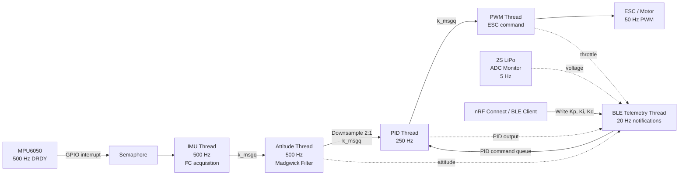
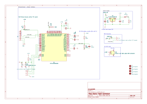
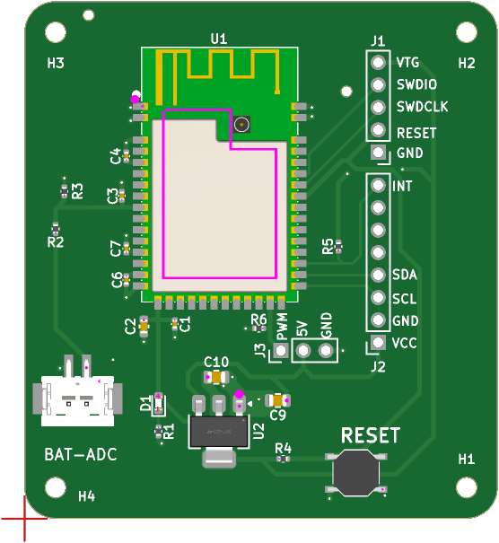

# Custom nRF52832 Drone Flight Controller

The controller performs 500 Hz interrupt-driven IMU reads and atittude estimation, a 250 Hz PID control pipeline, drives ESC through hardware PWM, monitors a 2S LiPo battery through the ADC, and exposes system telementry and PID configurations over BLE, allowing for real-time PID tuning.

## Key Structure/Features

### RTOS Firmware
- Zephyr RTOS with dedicated IMU, attitude-estimation, PID, PWM, system-monitoring, and BLE threads
- GPIO interrupt and semaphore-driven MPU6050 acquisition at 500 Hz
- Non-blocking message queues between processing stages

### Attitude Estimation + Control
- Madgwick IMU filter using accelerometer and gyroscope data
- Quaternion-to-Euler conversion for roll, pitch, and yaw
- 250 Hz single-axis PID control loop
- ESC command generation through the nRF52 hardware PWM peripheral

### BLE Telemetry
- Custom BLE GATT service
- 20 Hz telemetry broadcasts with attitude, throttle, battery voltage, and uptime
- Writable BLE characteristic for runtime PID gain configuration

### System Monitoring
- ADC-based monitoring of a 2S LiPo battery through a voltage divider
- Moving-average voltage filtering
- Approximate battery SOC tracking

## Architecture Overview

## Schematic
The custom PCB integrates the nRF52832 flight controller, MPU6050
interface, 2S LiPo voltage monitoring, ESC interface, 5 V-to-3.3 V
regulation, and SWD programming/debug access.

[View full schematic PDF](hardware/drone_fc_v1.0.pdf)

### PCB

